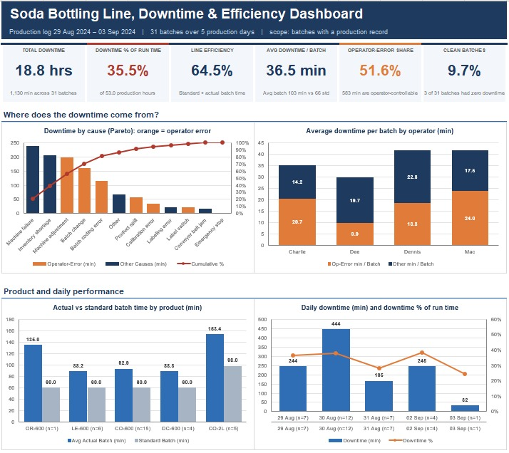

# Soda Line Downtime Dashboard

## Project Overview

The **Soda Line Downtime Dashboard** is an Excel-based business intelligence project designed to analyze production downtime and identify the major factors affecting the efficiency of a soda manufacturing line.

The project transforms raw production downtime data into an interactive dashboard that helps management monitor operational performance, identify recurring downtime causes, and understand where production time is being lost.

The analysis uses Microsoft Excel, including data cleaning, formulas, PivotTables, PivotCharts, KPIs, and interactive dashboard features.

## 🎯 Business Problem

Production downtime can reduce output, increase operating costs, delay production schedules, and affect overall manufacturing efficiency.

Management needs a simple way to answer questions such as:

- How much production downtime occurred?
- Which downtime reasons occur most frequently?
- Which machines or production lines experience the most downtime?
- When does downtime occur most often?
- Which downtime categories have the greatest impact?
- How can downtime be reduced?

This dashboard provides a centralized view of these operational indicators.

## 🎯 Project Objectives

The main objectives of this project are to:

- Analyze production downtime patterns
- Identify the most common causes of downtime
- Measure total downtime duration
- Compare downtime across production lines or machines
- Identify periods with higher downtime
- Create interactive KPIs for management reporting
- Provide data-driven insights that can support operational decision-making

## 🗂️ Dataset

The project uses production downtime records containing information about production activities and downtime events.

Typical fields analyzed include:

| Field | Description |
|---|---|
| Date | Date of the production activity |
| Production Line | Production line where the event occurred |
| Machine | Machine associated with the event |
| Downtime Reason | Reason for the downtime |
| Downtime Category | Classification of the downtime |
| Start Time | Time downtime started |
| End Time | Time downtime ended |
| Downtime Duration | Duration of downtime |
| Shift | Production shift |

## 🧹 Data Preparation

Before creating the dashboard, the dataset was reviewed and prepared for analysis.

The preparation process included:

- Checking column names
- Checking data types
- Identifying blank values
- Identifying inconsistent values
- Checking duplicate records
- Standardizing categorical values
- Validating downtime duration
- Creating analysis-ready fields
- Ensuring dates and times were correctly formatted

This step helped ensure that the dashboard calculations were based on consistent data.

## 📐 Analysis

The analysis focused on several operational areas.

**1. Total Downtime**
Measures the overall amount of production time lost due to downtime events.

**2. Downtime Events**
Counts the number of recorded downtime incidents.

**3. Average Downtime**
Measures the average duration of downtime events.

**4. Downtime by Reason**
Identifies the causes responsible for the largest amount of downtime.

**5. Downtime by Production Line**
Compares operational performance across production lines.

**6. Downtime by Machine**
Identifies machines associated with higher downtime.

**7. Downtime Trend**
Analyzes how downtime changes over time.

**8. Downtime by Shift**
Compares downtime performance across production shifts.

## 📌 Key Performance Indicators

The dashboard includes key operational KPIs such as:

- Total Downtime
- Total Downtime Events
- Average Downtime
- Maximum Downtime
- Most Frequent Downtime Reason
- Highest-Downtime Production Line
- Highest-Downtime Machine

These KPIs provide a quick overview of production performance.

## Dashboard Features

The interactive dashboard contains:

**KPI Cards**
Provides an immediate summary of important production metrics.

**Downtime Trend**
Shows how downtime changes over time.

**Downtime by Reason**
Highlights the major causes of production interruptions.

**Downtime by Production Line**
Compares downtime across production lines.

**Downtime by Machine**
Shows machines associated with downtime.

**Downtime by Shift**
Provides a shift-level comparison.

**Interactive Filters**
Users can filter the dashboard based on available dimensions such as:

- Date
- Production Line
- Machine
- Shift
- Downtime Category
- Downtime Reason

## 🛠️ Tools & Technologies

| Tool | Purpose |
|---|---|
| Microsoft Excel | Data analysis and dashboard development |
| Excel Tables | Structured data management |
| Excel Formulas | Calculations and data transformation |
| PivotTables | Data aggregation and analysis |
| PivotCharts | Data visualization |
| Slicers | Interactive filtering |
| Conditional Formatting | Highlighting important values |

## 📈 Business Insights

The analysis is designed to help management identify:

- The primary sources of production downtime
- Machines requiring operational attention
- Production lines experiencing higher downtime
- Shifts associated with increased downtime
- Recurring downtime patterns
- Areas where operational improvements may be considered

These insights can support maintenance planning, production scheduling, and continuous improvement initiatives.

## 💡 Recommendations

Based on the type of analysis performed, management can consider:

**1. Prioritize Major Downtime Causes**
Focus maintenance and operational improvement efforts on the causes contributing the largest amount of downtime.

**2. Monitor High-Downtime Machines**
Machines consistently associated with high downtime should receive closer monitoring and preventive maintenance attention.

**3. Review Production Shifts**
Where the data indicates meaningful differences between shifts, management can investigate staffing, maintenance, operating procedures, and workload differences.

**4. Track Downtime Continuously**
The dashboard can be updated regularly to monitor whether corrective actions are reducing downtime.

**5. Use Preventive Maintenance**
Historical downtime patterns can help maintenance teams identify equipment that may require more frequent inspection.

## 📸 Dashboard Preview

Add your dashboard screenshot to the repository and display it here:



## 📁 Project Structure

```
Soda-Line-Downtime-Dashboard/
│
├── README.md
│
├── Soda_Line_Downtime_Dashboard.xlsx
│
├── images/
│   └── dashboard.png
│
└── documentation/
    └── project_documentation.md
```

## 🚀 How to Use the Project

1. Download the Excel workbook.
2. Open `Soda_Line_Downtime_Dashboard.xlsx`.
3. Navigate to the dashboard sheet.
4. Use the available slicers and filters.
5. Explore the KPI cards and visualizations.
6. Analyze downtime by reason, machine, production line, shift, and date.
7. Review the underlying PivotTables and calculations where required.

## 📚 Skills Demonstrated

This project demonstrates practical skills in:

- Data Cleaning
- Data Analysis
- Excel Formulas
- PivotTables
- PivotCharts
- KPI Development
- Dashboard Design
- Data Visualization
- Business Intelligence
- Operational Analysis
- Business Problem Solving
- Data-Driven Decision Making

## 👨‍💻 Author

**Ibraheem Sule**
Senior Business Intelligence Developer|Power BI, Microsoft Fabric, SQL, Snowflake & Azure|Turning enterprise data into actionable insights

This project is part of my portfolio demonstrating practical applications of data analysis and business intelligence using Microsoft Excel.
